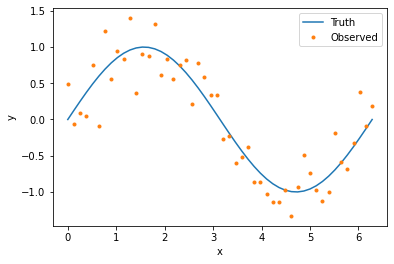
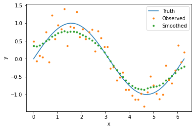
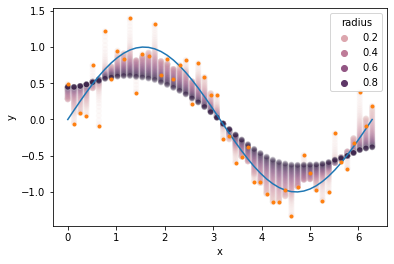
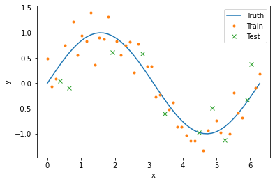
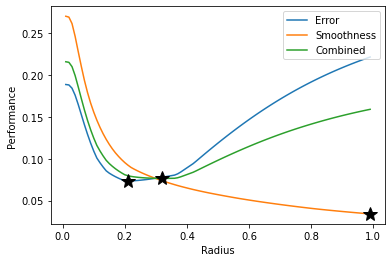
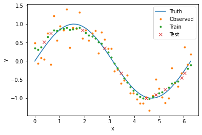

Quickstart
==========

The Basics
----------

The WeAve package has four main components:

1. The :doc:`Smoother <../api_reference/weave.smoother>` class, which computes
   weighted averages across data.
2. The :doc:`Dimension <../api_reference/weave.smoother>` class, where you
   specify how weights are computed for each dimension in your data.
3. The :doc:`kernel <../api_reference/weave.kernels>` functions, which compute
   weights given the distances between points.
4. The :doc:`distance <../api_reference/weave.distance>` functions, which
   compute the distances between points.

In this tutorial, we will smooth noisy data across one dimension. We will start
by importing all of the packages we will be using.

.. code-block::

    import matplotlib.pyplot as plt
    import numpy as np
    import pandas as pd
    import seaborn as sns

    from weave.dimension import Dimension
    from weave.smoother import Smoother

Data
^^^^

WeAve works with data in the form of `Pandas <https://pandas.pydata.org/>`_ 
data frames. The following code generates and plots our data set.

.. code-block::

    n_obs = 50
    x_val = np.linspace(0, 2*np.pi, n_obs)
    y_true = np.sin(x_val)
    y_obs = y_true + 0.3*np.random.normal(size=n_obs)

    data = pd.DataFrame({
        'x_id': np.arange(n_obs),
        'x_val': x_val,
        'y_true': y_true,
        'y_obs': y_obs
    })

    plt.plot(x_val, y_true, label='Truth')
    plt.plot(x_val, y_obs, '.', label='Observed')
    plt.xlabel('x')
    plt.ylabel('y')
    plt.legend()

Dimension
^^^^^^^^^

To smooth data using WeAve, we first need to specify the dimensions in our data
by creating an instance of the `Dimension` class. This object contains
information about how weights are computed. Many dimension parameters have
defaults, but at the minimum we need to include `name`. This corresponds to the
column in our data frame containing unique point IDs.

.. code-block::

    age = Dimension('x_id')

The dimension object above will have the default identity kernel (i.e., weights
are equal to distances) and Euclidean distance. Weights are computed using data
from the column of our data frame corresponding to the dimension attribute
`coordinates`, which is automatically assigned to the `name` parameter if not
specified.

To compute weights based on a column other than 'x_id', we can include the
`coordinates` parameter. Values in this column do not need to be unique, unlike
those corresponding to `name`.

.. code-block::

    age = Dimension('x_id', 'x_val')

All kernels other than the identity kernel have additional parameters. For this
tutorial, we will use the exponential kernel which requires a kernel radius.
The following code creates our smoothing dimension with default Euclidean
distance.

.. code-block::

    dimension = Dimension(
        name='x_id',
        coordinates='x_val',
        kernel='exponential',
        radius=0.5
    )

Smoother
^^^^^^^^

Our next step is to create an instance of the `Smoother` class using the
dimension object defined above. While this tutorial only uses one dimension,
you can also input multiple dimensions in a list.

.. code-block::

    smoother = Smoother(dimension)

To smooth our noisy data, we simply provide our data frame and the name of the
column or columns we would like to smooth (parameter `observed`). The output is
a copy of the input data frame with appended column(s) containing the smoothed
data. You can specify the column names of the smoothed values with the
parameter `smoothed`, otherwise '_smooth' will be appended to the column names
in `observed`. The following code smooths our data and plots the results.

.. code-block::

    result = smoother(data, 'y_obs', smoothed='y_smooth')

    plt.plot(x_val, y_true, label='Truth')
    plt.plot(x_val, y_obs, '.', label='Observed')
    plt.plot(result['x_val'], result['y_smooth'], '.', label='Smoothed')
    plt.xlabel('x')
    plt.ylabel('y')
    plt.legend()

Choosing Parameters
-------------------

The degree of smoothing is influenced by the choice of kernel parameters, so
it's important to find parameters that produce smooth results but don't
oversmooth. Below we see our example with values smoothed using radii between
zero and one. Radius values near zero hardly smooth the data at all, while
values near one smooth the data too much, moving points away from the true
curve and towards the data average.

.. code-block::

    results = []
    radii = np.arange(0.01, 1., 0.01)
    for radius in radii:
        smoother.dimensions[0].radius = radius
        result = smoother(data, 'y_obs', smoothed='y_smooth')
        result['radius'] = radius
        results.append(result)
    results = pd.concat(results)

    ax = sns.scatterplot(data=results, x='x_val', y='y_smooth', hue='radius', alpha=0.1)
    ax.plot(x_val, y_true)
    ax.plot(x_val, y_obs, '.')
    ax.set_xlabel('x')
    ax.set_ylabel('y')

To explore the tradeoff between data fidelity (i.e., how closely the smoothed
data follows the true curve) and smoothness, we can define functions that
measure each of these properties and evaluate them for different radius values.

Train/Test Split
^^^^^^^^^^^^^^^^

We will use `cross-validation <https://en.wikipedia.org/wiki/Cross-validation_(statistics)>`_
to compare our model error for different radii. In this framework, we randomly
split our data into two sets: 80% will go into the training set and 20% will go
into the test set. For each point in the test set, we will compute smoothed
values using weighted averages composed only of points in the training set. In
this way, we can infer how our model would perform on new or missing data. The
following code splits our data into the two sets and creates corresponding
boolean columns in our data frame.

.. code-block::

    data['train'] = True
    data.loc[np.random.choice(data['x_id'], size=n_obs//5, replace=False), 'train'] = False
    data['test'] = data['train'] == False

    plt.plot(x_val, y_true, label='Truth')
    plt.plot(data[data['train']]['x_val'], data[data['train']]['y_obs'], '.', label='Train')
    plt.plot(data[data['test']]['x_val'], data[data['test']]['y_obs'], 'x', label='Test')
    plt.xlabel('x')
    plt.ylabel('y')
    plt.legend()

Metrics
^^^^^^^

Next we define functions that measure the error and smoothness of our model
output. For error, we compute the mean absolute difference between the true
curve and the smoothed values in the test set. For smoothenss, we compute the
mean absolute difference between consecutive values in the entire data set.

When calling the smoother object, the optional parameters `fit` and `predict`
correspond to the columns in the data frame indicating which points to use in
the weighted averages and which points to smooth, respectively. If not
supplied, both default to the entire input data frame.

.. code-block::

    def get_error(radius):
        smoother.dimensions[0].radius = radius
        result = smoother(data, 'y_obs', smoothed='y_smooth', fit='train', predict='test')
        return np.mean(np.abs(result['y_true'] - result['y_smooth']))

    def get_smoothness(radius):
        smoother.dimensions[0].radius = radius
        result = smoother(data, 'y_obs', smoothed='y_smooth', fit='train')
        return np.mean(np.abs(np.diff(result['y_smooth'])))

Grid Search
^^^^^^^^^^^

To find the best radius value in terms of error and smoothness, we evaluate our
performance functions for radius values between zero and one. This is known as
a grid search. For problems with multiple dimensions and parameters, a grid
search can be inefficient, but there are other `hyperparameter optimization <https://en.wikipedia.org/wiki/Hyperparameter_optimization>`_
methods that can be used instead.

Because our error and smoothness metrics will have different optimal radii, we
create a third metric that combines the two properties. For this example, we
assume that error is twice as important as smoothness, so we use a convex
combination of the two metrics with weights that reflect this assumption.

.. code-block::

    error = np.array([get_error(radius) for radius in radii])
    smoothnesss = np.array([get_smoothness(radius) for radius in radii])
    combined = 2/3*error + 1/3*smoothness

    plt.plot(radii, error, label='Error')
    plt.plot(radii, smoothness, label='Smoothness')
    plt.plot(radii, combined, label='Combined')
    plt.plot(radii[np.argmin(error)], np.min(error), 'k*', markersize=15)
    plt.plot(radii[np.argmin(smoothness)], np.min(smoothness), 'k*', markersize=15)
    plt.plot(radii[np.argmin(combined)], np.min(combined), 'k*', markersize=15)
    plt.xlabel('Radius')
    plt.ylabel('Performance')
    plt.legend(loc='upper right')

For the exponential kernel, a larger radius produces smoother output, while the
lowest test error occurs at 0.21. Our combined metric is minimized at a radius
of 0.32, with smoothed data plotted below.

